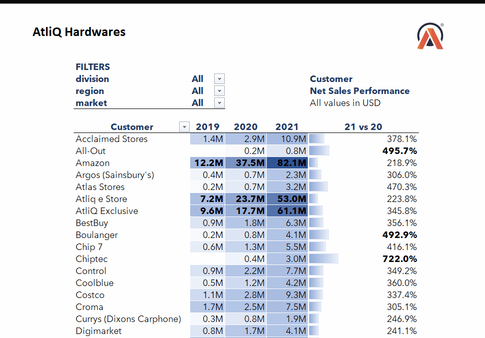
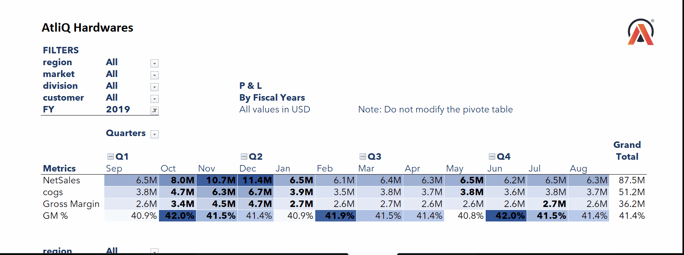

# Business-Performance-Reports

## Table of Contents
- [Overview](#overview)
- [Features](#features)
  - [Sales Report](#sales-report)
  - [Finance Report](#finance-report)
- [Installation Steps](#installation-steps)
- [Project Structure](#project-structure)
- [Technologies Used](#technologies-used)
- [Example Screenshots](#example-screenshots)
- [Contributions](#contributions)
- [License](#license)
- [Contact](#contact)

## Overview
### **This repository contains Sales and Financial Reports of AtliQ Hardwares.**

The project provides Sales and Finance Reports to help businesses analyze their performance, track key metrics, and make data-driven decisions. Using Excel, I have created an interactive dashboard that offers insights into Customer Behavior, Financial Performance, and Market trends.

## Features

### Sales Report
- **Customer Performance Analysis –** Evaluate individual customer contributions to revenue in 2019, 2020, 2021 and 21 vs 20.

- **Market Performance vs Sales Targets –** Compared actual sales against set goals.

- **Sales Trend Analysis –** Identify patterns to improve business strategies.

### Finance Report
- **Profit & Loss (P&L) Reports –** Generated by Fiscal Year, Quarterly and Monthly.

- **Gross Margin % –** Gross Margin % calculated quarterly and by sub-zone.

- **Budgeting & Forecasting –** Aid in financial planning and decision-making.

- **Strategic Financial Insights –** Align financial goals with business growth.


## How to Use

### **Download the Excel reports from the repository and explore the interactive dashboards.**


## Project Structure
```bash
Business-Performance-Reports/
│── Financial_Reports/                # Financial PDF reports
│── Sales_and_Marketing_Reports/      # Sales PDF reports
│── images/                           # GIFs
│── Business_Performance_Report.xlsx  # Main Excel file
│── LICENSE                           # License file
│── README.md                         # Project documentation
```


## Technologies Used
- **Microsoft Excel –** Data visualization and dashboard creation

- **Power Query –** Data extraction and transformation

- **Power Pivot –** Advanced data modeling

- **DAX (Data Analysis Expressions) –** Custom calculations


## Visual Overview

### Sales Performance Report


### Profit and Loss Statement by Fiscal Year and Months



## License
This project is licensed under the **MIT License** – see the LICENSE file for details.

## 🔗 Connect with Me

### For any inquiries, feel free to reach out:

[](https://github.com/Rohit-Phoenix)
[](https://www.linkedin.com/in/rohit-kumar-56188519/)

